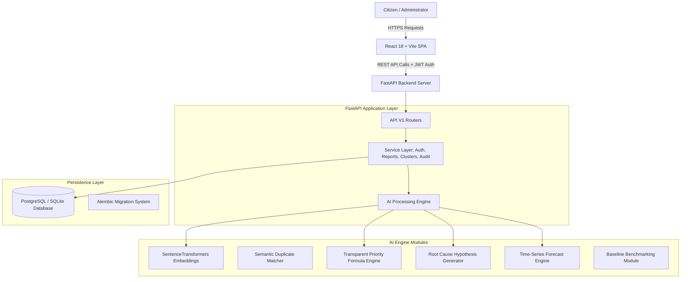

# CivicPulse AI — System Architecture & Explainable AI Specifications

This document outlines the architectural components, data flow, mathematical formulas, and explainable AI specifications of the CivicPulse platform.

---

## 1. High-Level System Architecture Diagram

---

## 2. Explainable Priority Scoring Engine Specifications

Unlike standard black-box machine learning rankers, CivicPulse calculates priority scores using an explicit mathematical formulation:

$$P = w_I \cdot I + w_U \cdot U + w_R \cdot R + w_A \cdot A$$

### Formula Components:
1. **Impact Component ($I \in [0, 100]$)**:
   - Evaluates citizen severity rating and public safety risk keyword detection.
   - Formula: $I = \min(100, \text{user\_impact} \times 10 + \text{hazard\_keywords\_count} \times 15)$

2. **Urgency Component ($U \in [0, 100]$)**:
   - Evaluates citizen time-sensitivity requirement.
   - Formula: $U = \text{user\_urgency} \times 10$

3. **Recurrence Bonus ($R \in [0, 100]$)**:
   - Penalizes issues in areas with repeated historical failures.
   - Formula: $R = \min(100, \text{recurrence\_count} \times 30)$

4. **Aging Component ($A \in [0, 100]$)**:
   - Prevents stale complaints from being indefinitely ignored.
   - Formula: $A = \min\left(100, \frac{\text{days\_open}}{30} \times 100\right)$

---

## 3. Database Schema Design (ER Specifications)

- **`users`**: `id` (UUID), `name`, `email` (Unique), `password_hash`, `role` (enum: citizen, administrator, system_admin), `is_active`, timestamps.
- **`issue_categories`**: `id` (UUID), `name`, `description`, `default_priority_weight`.
- **`reports`**: `id` (UUID), `submitter_id`, `category_id`, `cluster_id`, `title`, `description`, `impact`, `urgency`, `approximate_area`, `status`, timestamps.
- **`issue_clusters`**: `id` (UUID), `representative_title`, `representative_description`, `category_id`, `status`, `current_priority_score`, `recurrence_count`, timestamps.
- **`report_matches`**: `id` (UUID), `source_report_id`, `candidate_report_id`, `similarity_score`, `decision`, `decision_reason`, `reviewer_id`, timestamps.
- **`root_cause_hypotheses`**: `id` (UUID), `source_cluster_id`, `related_cluster_id`, `hypothesis_text`, `evidence_json`, `score_or_strength`, `uncertainty_label`, `review_status`, timestamps.
- **`audit_logs`**: `id` (UUID), `action`, `entity_type`, `entity_id`, `actor_id`, `reason`, timestamps.

---

## 4. Privacy & Data Protection Safeguards

Before passing raw citizen text into vector embedding models, text is sanitized:
- **PnP Anonymization**: Phone numbers, email addresses, and vehicle numbers are stripped using regular expression patterns.
- **Location Normalization**: Specific home addresses are mapped to approximate neighborhood zone names to preserve user anonymity.
