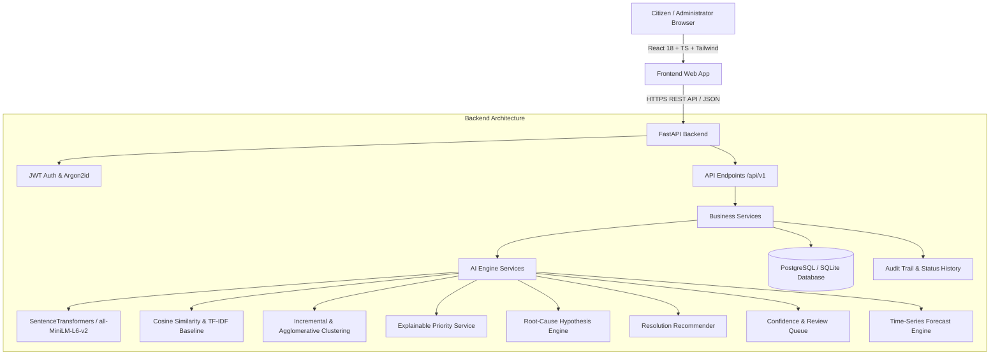

# Implementation Plan — CivicPulse AI Platform

CivicPulse is an explainable AI platform designed to transform civic issue management by providing semantic report matching, human-in-the-loop duplicate detection, incremental issue clustering, recurrence tracking, transparent priority scoring, evidence-backed root-cause discovery, resolution recommendations, confidence monitoring, and predictive forecasting.

## Architectural Design

## User Roles & Key Workflows

1. **Citizen**:
   - Register & log in securely.
   - Submit civic issues (Title, Description, Category, Impact, Urgency, Area, Image).
   - View similarity matches *before* submission to prevent redundant complaints.
   - Track submitted reports, status timelines, and recurrence alerts.

2. **Administrator**:
   - Review AI-suggested duplicate pairs with confidence scores and text evidence.
   - Approve, reject, or defer duplicate matches.
   - Manage issue clusters (merge, split, update status with mandatory reasons).
   - Review recurrence events on previously resolved issues.
   - Inspect transparent priority scores with detailed component explanations.
   - Explore AI root-cause hypotheses with evidence strength badges.
   - Utilize resolution recommendations from historical cases.
   - Manage AI confidence review queue for low-confidence or ambiguous cases.
   - Analyze issue trends, volume forecasts, and fairness distributions.

3. **System Administrator**:
   - Manage users, roles, categories, and priority weights.
   - Monitor AI model performance, evaluation benchmarks, and system audit logs.

## Proposed Implementation Phases

### Phase 1: Workspace & Environment Setup
- Create Python virtual environment and install backend dependencies (`fastapi`, `uvicorn`, `sqlalchemy`, `alembic`, `pydantic`, `python-jose`, `passlib[argon2]`, `sentence-transformers`, `scikit-learn`, `pandas`, `numpy`, `pytest`, `httpx`).
- Initialize React + TypeScript + Vite project with Tailwind CSS, React Router, Lucide icons, Recharts, TanStack Query, React Hook Form, and Zod.

### Phase 2: Database Schema & Migration Foundation
- Design SQLAlchemy 2.x models for all 15 core entities (`users`, `issue_categories`, `reports`, `report_embeddings`, `issue_clusters`, `report_matches`, `cluster_membership_history`, `status_history`, `recurrence_events`, `priority_snapshots`, `root_cause_hypotheses`, `resolution_recommendations`, `resolution_evidence`, `audit_logs`, `model_evaluations`).
- Configure Alembic migrations and database session manager with support for PostgreSQL and fallback SQLite mode.
- Build database seeder for synthetic, clearly labeled civic datasets with ground truth annotations.

### Phase 3: FastAPI Backend & AI Services Implementation
- **Auth & Security**: Argon2id password hashing, JWT access tokens, role-based authorization dependencies (`Citizen`, `Administrator`, `SystemAdmin`).
- **Reports & Clusters**: CRUD endpoints, status transitions with mandatory reason, cluster merge/split workflows.
- **AI Core Modules**:
  - `embeddings.py`: SentenceTransformer embeddings + TF-IDF baseline wrapper with persistent caching.
  - `similarity.py`: Cosine similarity ranking & candidate match retrieval.
  - `clustering.py`: Incremental cluster assignment & agglomerative clustering.
  - `recurrence_service.py`: Recurrence detection against resolved clusters.
  - `priority_service.py`: Transparent priority scoring $P = 0.35I + 0.25U + 0.25R + 0.15A$ with human-readable explanations.
  - `root_cause.py`: Cross-category correlation & hypothesis generator with evidence labels.
  - `recommendations.py`: Historical resolution similarity & action recommender.
  - `uncertainty.py`: Low-confidence prediction flagging & human review queue.
  - `forecasting.py`: Time-series forecasting (moving average, seasonal naive) & metric calculation.
  - `evaluation.py`: Automated benchmarking (Precision, Recall, F1, ARI, MAE).

### Phase 4: Frontend Application & UI Components
- Build modern, glassmorphism-enhanced CivicTech UI design system using dark navy text, crisp white surfaces, teal accents, and status badges.
- Pages:
  1. Landing Page
  2. Register & Login
  3. Citizen Dashboard
  4. Submit Report (with live similarity check)
  5. Report Details & Timeline
  6. Admin Dashboard
  7. AI Match Review Queue
  8. Issue Cluster Management
  9. Root Cause Discovery
  10. Resolution Recommendations
  11. Forecasting & Trends
  12. AI Confidence & Fairness Monitor
  13. System Administration & Audit Logs

### Phase 5: Automated Testing, Evaluation & Documentation
- Unit & Integration tests for FastAPI endpoints, status workflows, authorization, AI similarity, and priority calculations.
- Evaluation runner script producing benchmark metrics against baseline.
- Documentation: `README.md`, `architecture.md`, `database.md`, `api.md`, `ai-methodology.md`, `evaluation.md`, `user-guide.md`, and `docker-compose.yml`.
